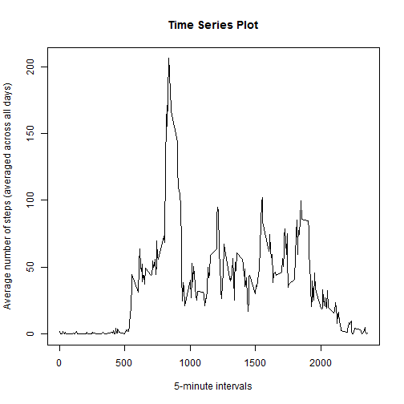

# Reproducible Research: Peer Assessment 1

This report is an analysis of data from personal activity monitoring device.   These type of devices are part of the "quantified self" movement - a group of enthusiasts who take measurements about themselves regularly to improve their health, to find patterns in their behavior, or because they are tech geeks. This device collects data at 5 minute intervals through out the day. The data consists of two months of data from an anonymous individual collected during the months of October and November, 2012 and include the number of steps taken in 5 minute intervals each day.

## Loading and preprocessing the data

First we load the data set in R. The file 'activity.csv' needs to be in your current working directory.


```r
activity <- read.csv("activity.csv")
```

## What is mean total number of steps taken per day?

Next we calculate the total of the steps taken for each day and plot a histogram.


```r
totalStepsPerDate <- tapply(activity$steps,activity$date,sum,na.rm=TRUE)
hist(totalStepsPerDate,xlab = "Total no. of steps taken per day",col="red", main = "Histogram from Activity Dataset")
```

 
Now we calculate the mean and median of these totals.


```r
summary(totalStepsPerDate)
```

```
##    Min. 1st Qu.  Median    Mean 3rd Qu.    Max. 
##       0    6778   10400    9354   12810   21190
```


As we can see the **mean is 9354** and the **median is 10400**.


## What is the average daily activity pattern?

We will calculate the average number of steps taken across all days for the 5-minute intervals and make a time series plot of the same. The `x axis` will have the 5-minute interval and the `y axis` will have the average number of steps taken, averaged across all days.


```r
avgDailyActivity <- tapply(activity$steps,activity$interval,mean,na.rm=TRUE)
plot(avgDailyActivity ~ names(avgDailyActivity),type="l",xlab="5-minute intervals",ylab="Average number of steps (averaged across all days)",main="Time Series Plot")
```

 

To get the 5-minute interval that contains the maximum number of steps on average across all the days in the dataset, we write the following code:


```r
avgDailyActivity[avgDailyActivity == max(avgDailyActivity)]
```

```
##      835 
## 206.1698
```


The desired **5-minute interval is 835** with a value of 206.1698.


## Imputing missing values

Note that there are a number of days/intervals where there are missing values (coded as NA). The presence of missing days may introduce bias into some calculations or summaries of the data. Let us see wfich columns contain `NA`s and its count.


```r
lapply(lapply(activity,is.na),sum)
```

```
## $steps
## [1] 2304
## 
## $date
## [1] 0
## 
## $interval
## [1] 0
```


As we can see from the output, **the total number missing values in the dataset is 2304**


### Strategy for filling missing values

To impute the missing values we will take the mean of the total number of steps for each 5 minute interval and put it for the missing values for that time interval and create a new dataset from the original dataset but with missing valuse filled in. The below code might take few seconds to complete.


```r
datesNA <- as.character(unique(activity[is.na(activity$steps),"date"]))
activityFull <- activity
for(dat in datesNA){
  count <- 0;
  for (i in unique(activityFull$interval)){
    count <- count+1
    activityFull[activityFull$date==dat & activityFull$interval==i,"steps"] <- 
      avgDailyActivity[count]
  }
}
```

Now we use this new dataset to calculate the total of the steps taken for each day and plot a histogram for the same. We even calculate the statistics as we did for the original dataset and then compare the two.


```r
totalStepsPerDateFull <- tapply(activityFull$steps,activityFull$date,sum)
hist(totalStepsPerDateFull,xlab = "Total no. of steps taken per day",col="red", main = "Histogram from Activity Dataset after filling missing values")
```

 

```r
summary(totalStepsPerDateFull)
```

```
##    Min. 1st Qu.  Median    Mean 3rd Qu.    Max. 
##      41    9819   10770   10770   12810   21190
```


The **mean has increased from 9354 to 10770 and the median from 10400 to 10770**. Also the distribution is more normal than before.


## Are there differences in activity patterns between weekdays and weekends?

For this part first we create a new factor variable in the dataset with two levels - "weekday" and "weekend" indicating whether a given date is a weekday or weekend day and then make a panel plot containing a time series plot of the 5-minute interval (x-axis) and the average number of steps taken, averaged across all weekday days or weekend days (y-axis).

```r
activityFull$date <- as.Date(activityFull$date, "%Y-%m-%d")
activityFull$type_day <- "weekday"
activityFull[weekdays(activityFull$date) %in% c("Saturday","Sunday"),"type_day"] <- "weekend"
activityFull$type_day <- as.factor(activityFull$type_day)

avgDailyActivityDaywise <- tapply(activityFull$steps,list(activityFull$interval,activityFull$type_day),mean)
avgDailyActivityDaywise1 <- data.frame("AvgSteps"=avgDailyActivityDaywise[,"weekday"],"interval"=as.numeric(rownames(avgDailyActivityDaywise)),"day"=rep("weekday",nrow(avgDailyActivityDaywise)))
avgDailyActivityDaywise2 <- data.frame("AvgSteps"=avgDailyActivityDaywise[,"weekend"],"interval"=as.numeric(rownames(avgDailyActivityDaywise)),"day"=rep("weekend",nrow(avgDailyActivityDaywise)))
avgDailyActivityDaywise <- rbind(avgDailyActivityDaywise1,avgDailyActivityDaywise2)
library(lattice)
xyplot(AvgSteps ~ interval|day, 
       data = avgDailyActivityDaywise,
       type = "l",
       xlab = "Interval",
       ylab = "Number of steps",
       layout=c(1,2),main="Average activity by Weekday/Weekend")
```

 
